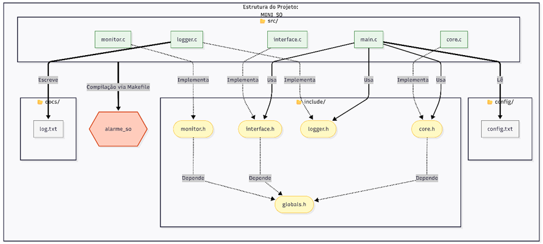
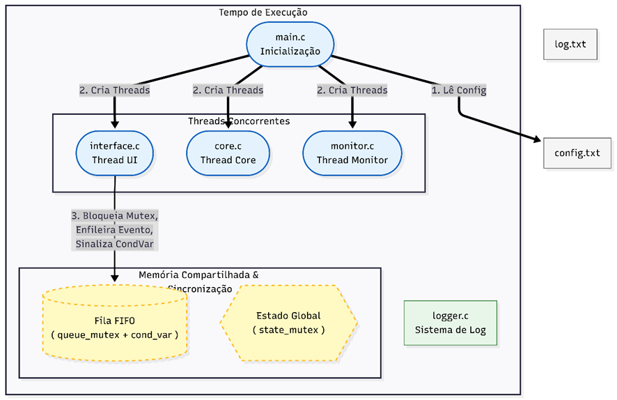

# Mini SO Alarme

**Sistema de Alarme Residencial com Arquitetura Multi-Thread**

**Disciplina:** Sistemas Operacionais II

**Alunos:** Carlos Eduardo Watanabe, Lucas Barbosa Antonelli, Lucas Medolla de Paula

---

## Descrição do Projeto

Mini Sistema Operacional em espaço de usuário para controle de alarme residencial, implementado em C para Linux. O sistema demonstra conceitos de:

- **Multi-threading** com POSIX threads
- **Sincronização** com Mutexes e Condition Variables
- **Comunicação IPC** via fila de eventos em memória compartilhada
- **Sistema de Arquivos** para configuração e logging

---

## Arquitetura

### Threads do Sistema

| Thread        | Tipo       | Descrição                                     |
| ------------- | ---------- | --------------------------------------------- |
| **Core**      | Reativa    | Processa eventos e gerencia estados do alarme |
| **Monitor**   | Periódica  | Verifica sensores e controla sirene           |
| **Interface** | Interativa | Recebe comandos do usuário via CLI            |

### Organização da Aplicação



### Comunicação do Sistema



### Sincronização

- **3 Mutexes**: `state_mutex`, `queue_mutex`, `log_mutex`
- **1 Condition Variable**: `queue_cond` (notificação de eventos)
- **Fila FIFO Circular**: 10 slots para eventos

---

## Compilação

### Pré-requisitos

- Linux (ou WSL)
- GCC
- Make

### Comandos

```bash
# Compilar
make

# Compilar e executar
make run

# Limpar arquivos compilados
make clean
```

---

## Como Usar

### Iniciar

```bash
./alarme_so
```

### Comandos Disponíveis

| Comando | Descrição |
|-------------- ''''''''''''''''''''''''''''''-----|------------------------------------|
| `status` | Mostra estado do sistema |
| `arm <senha>` | Arma o alarme (senha: 1234) |
| `disarm <senha>` | Desarma o alarme |
| `sensor <id>` | Simula sensor (0=porta, 1=janela, 2=movimento) |
| `exit` | Encerra o sistema |

### Exemplo de Uso

```bash
$ ./alarme_so
--- Mini SO Alarme Iniciado ---
Comandos: arm <senha>, disarm <senha>, sensor <id>, status, exit

> status
Estado: 0 (0=OFF, 1=ARM, 2=TRIG)
Sensores: [0]=0, [1]=0, [2]=0

> arm 1234
> status
Estado: 1 (0=OFF, 1=ARM, 2=TRIG)

> sensor 0
!!! SIRENE TOCANDO !!!

> disarm 1234
> exit
```

---

## Configuração

Edite `config/config.txt`:

```
INTERVAL=3
PASSWORD=1234
```

- **INTERVAL**: Segundos entre verificações do monitor
- **PASSWORD**: Senha numérica do sistema

---

## Estados do Sistema

| Estado    | Código | Descrição                      |
| --------- | ------ | ------------------------------ |
| DISARMED  | 0      | Sistema desligado              |
| ARMED     | 1      | Sistema armado, monitorando    |
| TRIGGERED | 2      | Alarme disparado, sirene ativa |

---

## Logging

Todos eventos são registrados em `log.txt`:

```
[Fri Dec 12 00:10:55 2025] Sistema Iniciando...
[Fri Dec 12 00:10:55 2025] COMANDO: Sistema ARMADO.
[Fri Dec 12 00:10:55 2025] SENSOR: Sensor 0 mudou para 1
[Fri Dec 12 00:10:55 2025] ALERTA: ALARME DISPARADO POR SENSOR!
```

---

## Conceitos de SO Aplicados

- ✅ Processos e Threads (pthreads)
- ✅ Programação Concorrente
- ✅ Sincronização (Mutex, Condition Variables)
- ✅ Comunicação entre Threads (Fila FIFO)
- ✅ Sistema de Arquivos (config + log)
- ✅ Escalonamento Cooperativo

---

## Documentação

- [README.md](README.md) - Este arquivo
- [RELATORIO.md](RELATORIO.md) - Relatório técnico completo (6 páginas)

---

**Última atualização:** 12/12/2025
